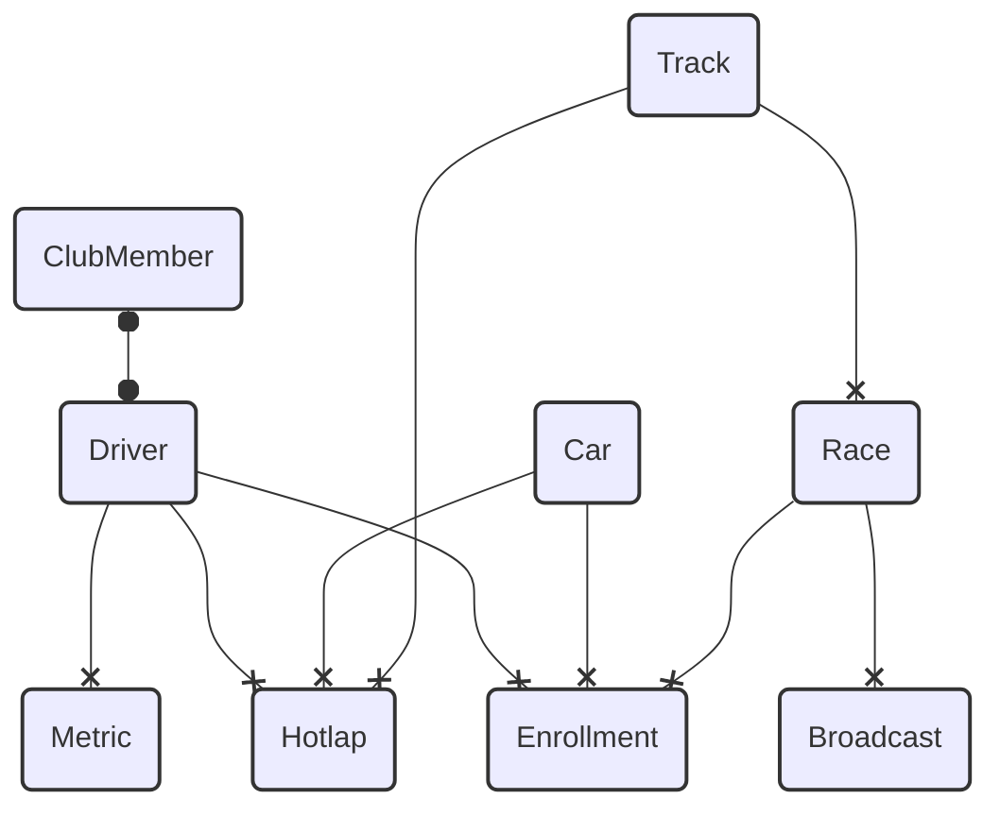

# Model de dades actual



# Guia d'Instal·lació i Configuració del Projecte

## 1. Clonar el Repositori

Primerament, clona el repositori del projecte existent al teu entorn local:

```bash
git clone https://github.com/00spoiler00/atotdrap.latrup.net
cd atotdrap.latrup.net
```

## 2. Instal·lació de Dependències Backend

Un cop dins el directori del projecte, instal·la les dependències de PHP utilitzant Composer:

```bash
composer install
```

## 3. Configuració de l'Entorn

Copia el fitxer d'exemple `.env` i configura les variables d'entorn segons les necessitats del teu entorn de desenvolupament:

```bash
cp .env.example .env
```

Modifica el fitxer `.env` per establir la configuració de la base de dades i altres variables d'entorn necessàries.

## 4. Generació de la Clau de l'Aplicació

Genera la clau d'aplicació de Laravel amb el següent comandament:

```bash
php artisan key:generate
```

## 5. Executar les Migracions

Executa les migracions per crear les taules necessàries a la base de dades (junt amb els seeders):

```bash
php artisan migrate:fresh --seed
```

## 6. Instal·lació de Dependències Frontend

Per instal·lar les dependències del frontend, assegura't de tenir `Node.js` instal·lat i després executa:

```bash
npm install
```

## 7. Compilar els Actius amb Vite

Laravel utilitza Vite per a la compilació dels actius frontend. Per iniciar el procés de compilació i observar canvis en temps real, executa:

```bash
npm run dev
```

## 8. Executar el Servei de Desenvolupament de Laravel

Per posar en marxa el servidor de desenvolupament de Laravel, executa:

```bash
php artisan serve
```

Aquesta ordre iniciarà el servidor de Laravel i l'aplicació estarà disponible a `http://localhost:8000`.

## 9. Hidratació de Dades des de Fonts Externes

El projecte pot requerir la importació de dades des de fonts externes. Per fer-ho, executa els comandaments situats a la carpeta `commands`:

```bash
php artisan app:update-drivers-and-registrations
```

## 10. Comprovacions Finals

Assegura't que tots els passos s'han completat correctament i verifica que l'aplicació funciona com s'espera.

---

Amb aquests passos, hauràs configurat correctament l'entorn de desenvolupament per al projecte Laravel amb Vue.js i Vite. Recorda seguir les millors pràctiques per mantenir el `.env` fora del control de versions i assegurar la correcta configuració de l'entorn.
